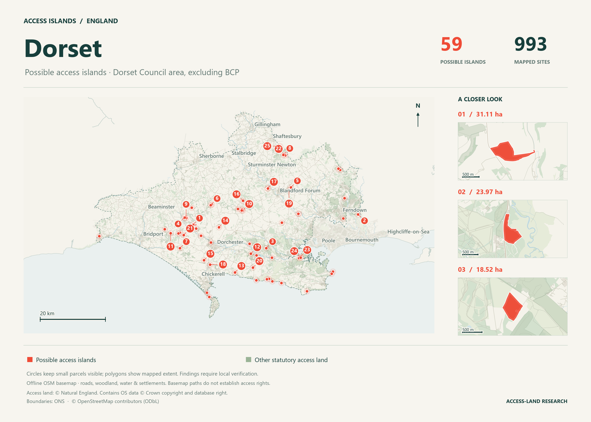

# England access islands

Map


Find **CRoW access-land sites with no evidenced walking connection to the public road network**. The pipeline uses official land boundaries, council-derived rights of way and tagged OpenStreetMap routes. It generates a complete site inventory, a candidate shortlist, GIS evidence and a local interactive map.

This is a screening tool. A missing mapped connection does not establish that no lawful entrance exists. Access land can be privately owned; the output concerns public access rights, not ownership.


## Install and try the example

Python 3.12+ and [uv](https://docs.astral.sh/uv/) are required. On Windows, run from this directory:

```powershell
uv sync --python 3.12
uv run access-islands demo --data-dir data/demo --output-dir outputs/demo
Start-Process outputs/demo/map/index.html
```

The demo has four **synthetic sites**, not real access islands: a connected site, a private-track-only site, a permissive approach and a disconnected internal public path. It also tests overlapping land datasets. Its map is labelled accordingly.

## Research a county or region

```powershell
uv run access-islands research --county "Isle of Wight"
uv run access-islands research --county "Devon"
uv run access-islands research --region cumbria
uv run access-islands research --region dorset
uv run access-islands research --region cheltenham-gloucester
uv run access-islands regions
```

Each completed area gets a named Markdown report in **`reports/`**, two offline PNG maps in `reports/maps/`, and an immutable package in `outputs/regions/<area>/runs/<analysis-signature>/`. County-root filenames are convenience copies of the latest validated package. Start with [the report index](reports/README.md). Reports link the interactive map, full, candidate and permissive-access CSVs, GIS evidence and review samples. Reports are written only after processing and automated export validation complete; processing completion does not imply manual verification of access rights. Dorset covers Dorset Council (E06000059), excluding Bournemouth, Christchurch and Poole.

The `cheltenham-gloucester` preset covers Cheltenham borough and Gloucester city plus 10 km of surrounding countryside, using the Gloucestershire OSM extract. Its report separates sites intersecting those districts from the additional surrounding sites. Custom regional configurations can set `study_buffer_m` to expand their authority boundaries. This changes which land is studied; `analysis.context_buffer_m` controls the additional route-search context. An explicit `--bbox` clips the expanded study boundary.

Existing downloads, cleaned land and the site catalogue are reused. Regional runs extract nearby routes **before** constructing their networks, with a 20 km surrounding buffer by default. They retain full cross-border land sites and stable IDs. Unresolved possible connections reaching the context edge are flagged `regional_context_incomplete`; when the shared route coverage permits, the buffer expands up to 80 km. Private routes remain excluded from the walking graph.

Completed GB routes provide reusable local subsets. The Isle of Wight, Devon, Cumbria and Dorset presets use small Geofabrik extracts for route and common-area evidence, preserving their cached snapshots for repeat runs. Custom regions can specify their own regional PBF and coverage polygon. An extract's actual coverage constrains the surrounding context and is recorded in the report.

On a fresh installation, `research` downloads and normalises shared land, PRoW and administrative references without importing GB OSM. You can prepare these references separately with `uv run access-islands reference`. `--refresh` on research rebuilds that region's inputs and analysis; it does not refresh all national reference sources. Refresh references explicitly with `reference --refresh`.

Combine areas or name a custom selection:

```powershell
uv run access-islands research --county Cumberland --county "Westmorland and Furness" --name Cumbria
uv run access-islands research --bbox 430000 75000 465000 100000 --name "South coast selection"
```

Selections without an available regional OSM preset need completed shared GB routes or configured regional OSM inputs. Run progress is stored in each output folder's `progress.json`, with completed/total input ways, tiles and sites. The number of generated segments is an output statistic, not a percentage denominator. Per-region preparation and graph caches support resume. Re-exporting preserves review outcomes and notes for matching site IDs.

To regenerate an existing completed area's report:

```powershell
uv run access-islands report --output-dir outputs/regions/isle-of-wight
```

## Optional England-wide run

```powershell
uv run access-islands run --national --data-dir data --output-dir outputs/england
Start-Process outputs/england/map/index.html
```

The first run downloads several GB and needs additional disk space for extracted and prepared data. A 32 GB machine is a practical starting point; exact runtime and memory depend on the snapshots. All work is local after downloading. No Overpass API requests or hosting account are needed.

Stages can also be run individually:

```powershell
uv run access-islands download
uv run access-islands prepare
uv run access-islands analyse --national --output-dir outputs/england
uv run access-islands export --output-dir outputs/england
```

Rerun the same command after interruption. Completed downloads, OSM imports and spatial-join tiles are cached. Input/configuration/code changes invalidate downstream caches. `--refresh` forces rebuilding the requested stages and reacquisition for `download`/`run`.

`analyse` or `run` with an authority, county, region or bounding box uses the regional research workflow and generates its report:

```powershell
uv run access-islands analyse --authority E06000046
```

Regional analysis includes surrounding routes and records limitations at its extraction edges. The optional national network can include routes crossing Wales or Scotland.

## Configuration and sources

Copy `config.example.toml` to `config.toml` if you want local inputs, source URL overrides, different matching parameters or a council-specific rights-of-way replacement. Pass `--config config.toml` to each stage, or to `run`. Relative input paths resolve against the TOML file.

Default sources:

| Input | Publisher/source | Purpose |
| --- | --- | --- |
| CRoW Access Layer | [Natural England](https://www.data.gov.uk/dataset/05fa192a-06ba-4b2b-b98c-5b6bec5ff638/crow-act-2000-access-layer2) | Official access-land boundaries |
| Section 16 Dedicated Land | [Natural England](https://environment.data.gov.uk/dataset/2bc7c6e4-30dc-429a-a673-2b7145b54173) | Dedicated land; overlaps reconciled |
| Section 15 Land | [Natural England](https://environment.data.gov.uk/dataset/72eda560-eee8-4667-a588-b5289c4ae011) | Pre-existing statutory access sites; recorded Act and common name retained |
| PRoW network | [Green Infrastructure Module 3](https://designatedsites.naturalengland.org.uk/GreenInfrastructure/UserGuide/DataDownloads.aspx) | Council-derived walking rights of way |
| Missing authorities | [Module 3 documentation](https://designatedsites.naturalengland.org.uk/GreenInfrastructure/UserGuide/GreenInfrastructureModules.aspx) | Explicit coverage gaps |
| Great Britain `.osm.pbf` | [Geofabrik](https://download.geofabrik.de/europe/great-britain.html) | Roads, tagged paths, topology and barriers |
| December 2025 full-resolution boundaries | [ONS](https://www.ons.gov.uk/methodology/geography/geographicalproducts/opengeography) | England clipping and administrative labels |

The rights-of-way network is selected from the current parent Module 3 package; the older child catalogue has no downloadable files. Multi-layer local datasets require an explicit `layer` if selection is ambiguous. Dataset URLs, dates, versions, attribution and SHA256 hashes are recorded in `data/sources.json` and the output manifest. Source dates may differ; a recent download date does not mean every council route has been recently surveyed.

The current CRoW Access Layer already includes Section 16 dedication and removes certain exclusions. When its `s16` field declares that combined inventory, it takes precedence over the older separate dedication layer; the latter is accounted for as superseded and cannot reintroduce excluded land. For custom primary inputs, `sources.land.includes_section16` can explicitly override this detection.

Regional research additionally includes section 15 land, united with overlapping CRoW sites to avoid double-counting area. The separate combined catalogue leaves existing route-import caches intact. `site_lineage.csv` records old/new relationships; topologically unchanged complete geometries keep their old IDs. Changed geometry receives a new ID and does not inherit old reviews. Original legal attributes remain in `legal_source_attributes`; `registered_common_land` and `access_regimes` expose the recorded RCL, open-country, section 16 and section 15 regimes. Local/synthetic fixtures opt in with `analysis.include_section15=true` and a local section 15 source.

OSM polygons tagged `designation=common`, `leisure=common` or `landuse=common` appear as **unverified** context, with their raw access and foot tags retained. They are not statutory study sites and cannot establish public or permissive access. Private/no areas are excluded from walking connections. Other common-area nodes participate only in the possible graph under the same contact, grade and entrance checks as official sites. The interactive map has an optional commons overlay. OS Open Greenspace and premium OS route products are deferred.

## How classifications work

1. Repair and split land geometry, clip it to England, and group overlapping polygons or polygons sharing a boundary segment. Preserve component provenance. Separated multipart pieces and corner-only contacts remain distinct sites.
2. Stream OSM twice to identify real node junctions and build route segments. Apply pedestrian-specific access tags before general access tags. Private/prohibited tracks are excluded; untagged paths are unknown; ordinary unrestricted roads supply inferred pedestrian anchors.
3. Add official rights-of-way lines. Connect their endpoints to compatible lines within 2 m by default. OSM ways connect through shared nodes, not through coincidental geometric crossings. Bridges, tunnels and mapped blocking barriers constrain connections.
4. Join routes and access-land sites in 20 km tiles, reconcile them globally, and trace connections through both routes and sites to roads extending outside access land. An isolated path wholly inside a site supplies no external access.
5. Compare matches at 0 m, the configured tolerance and at least 5 m. A consistent strong public connection wins. A consistent strong connection in the public-plus-permissive graph produces `permissive_access_evidenced`; permission may change and an unmapped public approach may also exist. Weak contacts, unknown route access, unverified commons, missing official coverage and sensitivity to tolerance produce review flags.

| Status | Meaning |
| --- | --- |
| `access_evidenced` | A consistent mapped walking connection to an external road was found |
| `permissive_access_evidenced` | A consistent strong connection using permissive routes was found; permission may change |
| `likely_access_island` | No usable connection was evidenced, without a detected reason to defer classification |
| `uncertain` | Coverage, geometry, access tags, barriers or weak connections require review |

Shared road/land boundaries without an entrance are weak evidence. A mapped passable gate or stile can resolve that particular uncertainty. The tool does not assume every adjacent road gives entry to a fenced field.

Very small polygons can be fragments from coastline clipping or source boundaries. Sites below 100 m² are retained with a `very_small_site_geometry` flag, and require review before they can become candidates; consistent mapped access can still establish `access_evidenced`. Set `analysis.min_candidate_area_m2` to change this review threshold, or to `0` to disable it. Reports show how much of the inventory consists of these small polygons.

Bridges, tunnels and elevated routes crossing a site do not establish entry to its surface. Official paths whose contact lies entirely alongside such a mapped route are also flagged for review; a separate ground-level approach can still establish access.

Important limits: road anchors are inferred from OSM, not certified highway-adoption records; not all entrances, fences or obstacles are mapped; internal fences are not a complete terrain/passability model; temporary closures are not evaluated. Parks outside the statutory inventories, coastal margin, foreshore and other access regimes may provide unmodelled approaches. Section 15 rights vary by the recorded Act and need current local verification. Official route intersections are joined through endpoints; poorly segmented source networks can remain disconnected and need review. Never infer permission to cross private intervening land from this output.

## Outputs

| File | Contents |
| --- | --- |
| `sites.csv` | Every connected site, including accessible and uncertain sites |
| `likely_access_islands.csv` | Candidate shortlist |
| `permissive_access_evidenced.csv` | Sites with consistent permissive-route evidence |
| `results.gpkg` | Full-resolution site polygons, candidate sites, nearby route evidence, barriers, rejected geometry and coverage gaps |
| `likely_access_islands.geojson` | Candidate polygons in latitude/longitude |
| `route_contacts.csv` | Site/route relationships, distance, access tier and weak-contact flag |
| `site_membership.csv` | Source component to site mapping |
| `site_lineage.csv` | Previous/current catalogue IDs and geometry relationships |
| `component_accounting.json` | Every original source component: processed, outside England, superseded or rejected |
| `run_manifest.json`, `quality_report.md` | Counts, scope, parameters, source provenance and run limitations |
| `review_sample.csv` | Largest 10 examples per status plus all previously reviewed matching sites |
| `desk_review.csv`, `reviews/<digest>/desk_review.csv` | Dated checks of published evidence, separately versioned from analysis |
| `map/index.html` | Local interactive map with clusters, filters, search and on-demand polygons |

CSV coordinates are representative points inside their sites, not centroids that may fall outside. Fields include hectares, county/unitary area, council names/codes, all intersected authorities, reasons and source versions. The primary authority has the greatest area overlap; metropolitan/London areas missing from the county layer use the council as their display grouping. Unknown names get explicit generated labels. Straight-line nearest-route distance includes private routes and is not a walking distance; blank means none was found within the 6.4 km search limit.

The map works when opened directly as a local file. Leaflet and clustering scripts ship with the application and are copied alongside the outputs with their licences; polygon partitions load as local scripts. Export needs no network connection. Only the optional OSM basemap needs internet. Classification geometry remains full resolution in the GeoPackage; map polygons are simplified for display.

County report images use an atlas layout with no coordinate axes or grid: muted roads, water, woodland and settlement labels support vivid candidate polygons. Candidate graphics include close-up panels for the three largest sites and numbered references to the report table. Both 2,800 × 2,000 PNGs and scalable SVGs are saved in `reports/maps/`.

The detailed static basemap is assembled from the existing regional OSM PBF and cached in its adjacent `cartography/` directory. It requires no tile service, API key or extra download and is separate from route preparation. Basemap paths show context only; their appearance does not establish a right of way. If a suitable local county extract is unavailable, the map uses an explicitly labelled outline fallback. `reports/maps/<area>-style.json` records the basemap source hash, feature counts and presentation signature.

Regenerate the graphics and Markdown from completed analysis without running research again:

```powershell
uv run access-islands report --output-dir outputs/regions/dorset --reports-dir reports
uv run access-islands report --output-dir outputs/regions/isle-of-wight --reports-dir reports
```

See [source decisions and the Dorset pilot](RESEARCH_SOURCES.md) for OS data, common-land interpretation and council desk-review sources. Earlier county reports and their map images are retained under `reports/history/<area>/<signature>/` when analysis changes. Visual revisions with the same analysis are archived in a `presentation-<signature>` subdirectory. Their links point to completed analysis packages. Review outcomes for changed IDs remain in history and are not automatically reassigned.

Exit codes: `0` successful; `1` failed stage; `2` partial analysis containing rejected land components; `130` interrupted. A failed stage writes `last_failure.json`. Inspect the run manifest and component accounting before treating a run as complete.

## Verification

```powershell
uv run pytest -q
uv run ruff check .
```

Tests exercise access-tag precedence, barriers, adjoining land, private/permissive tracks, disconnected paths, grade-separated OSM crossings, mapping tolerances, missing coverage, tile seams, multipart geometry, rejected components, paginated service completeness, archive traversal, empty selections and matching CSV/GIS IDs.

Before relying on candidates, inspect representative sites against current council definitive maps and entrance evidence. The generated quality report distinguishes automated validation from manual or field inspection; it does not claim either has occurred.
