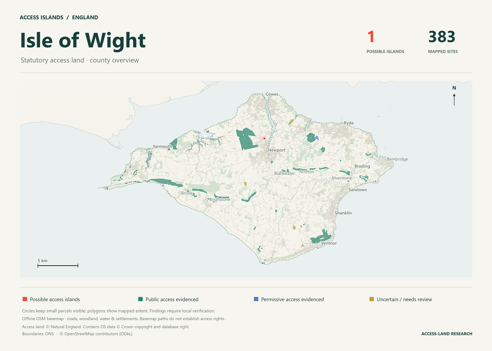
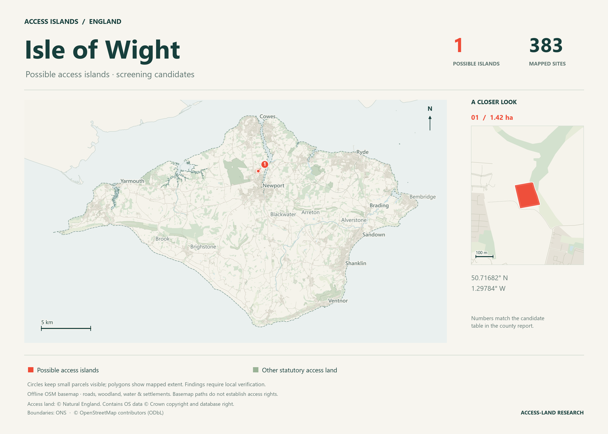

# Isle of Wight — access-land research report

Generated: 2026-10-05T17:55:48.049277+00:00

Processing and automated export validation are complete. These are screening findings. Recorded review outcomes: 0; blank reviews remain outstanding.

Study authorities: E06000046.
Surrounding context buffer requested: 20 km. Limited by source extract coverage: yes.

## Results

| Classification | Sites |
| --- | ---: |
| likely access island | 1 |
| uncertain | 305 |
| access evidenced | 73 |
| permissive access evidenced | 4 |
| Total | 383 |

Access-land area in reported complete sites: 1,290.38 ha.
Sites containing registered common land: 31. Sites containing section 15 statutory land: 13. Unverified OSM common areas in the surrounding context: 5.
Sites with unresolved connections at the regional context edge: 0.

Very small polygons below the 100 m² geometry-review threshold: 318 of 383. Sites at or above that threshold: 65.
Tiny fragments may arise from coastline clipping or source boundaries. They remain in the full inventory; an absence of mapped approaches alone does not promote them to candidates. Grey dots show uncertain sites with this geometry flag.

Sites crossing the study boundary retain their full geometry and stable IDs. They may also appear in neighbouring reports.

## Maps

Map dots keep small sites visible; coloured polygons show their mapped extent. Candidate numbers correspond to the table below.

The atlas graphics include close-up panels for the largest candidates. Roads, woodland, water and settlement names come from the cached OSM extract. Basemap paths are context and do not establish access rights.

Vector graphics for sharing or printing: [overview SVG](maps/isle-of-wight-overview.svg) · [candidate SVG](maps/isle-of-wight-candidates.svg).

[Open the interactive map](../outputs/regions/isle-of-wight/runs/3408816bdcb6534a8fa57a89dd8c21ab5c14f314e9d783ae439199b3b15716a3/map/index.html) to search all sites, inspect boundaries and follow site links.

## Candidate sites

Up to 25 candidates are listed below, largest first; the candidate CSV contains the complete list.

| Map number | Site | Area (ha) | Latitude | Longitude | Council |
| ---: | --- | ---: | ---: | ---: | --- |
| 1 | [site-423ceec23b5788ee](../outputs/regions/isle-of-wight/runs/3408816bdcb6534a8fa57a89dd8c21ab5c14f314e9d783ae439199b3b15716a3/map/index.html?site=site-423ceec23b5788ee) | 1.42 | 50.716821 | -1.297841 | Isle of Wight |

## Downloads and review

- [Complete site CSV](../outputs/regions/isle-of-wight/runs/3408816bdcb6534a8fa57a89dd8c21ab5c14f314e9d783ae439199b3b15716a3/sites.csv)
- [Candidate CSV](../outputs/regions/isle-of-wight/runs/3408816bdcb6534a8fa57a89dd8c21ab5c14f314e9d783ae439199b3b15716a3/likely_access_islands.csv)
- [Permissive access evidenced CSV](../outputs/regions/isle-of-wight/runs/3408816bdcb6534a8fa57a89dd8c21ab5c14f314e9d783ae439199b3b15716a3/permissive_access_evidenced.csv)
- [GIS polygons and route evidence](../outputs/regions/isle-of-wight/runs/3408816bdcb6534a8fa57a89dd8c21ab5c14f314e9d783ae439199b3b15716a3/results.gpkg)
- [Review sample](../outputs/regions/isle-of-wight/runs/3408816bdcb6534a8fa57a89dd8c21ab5c14f314e9d783ae439199b3b15716a3/review_sample.csv)
- [Quality and provenance report](../outputs/regions/isle-of-wight/runs/3408816bdcb6534a8fa57a89dd8c21ab5c14f314e9d783ae439199b3b15716a3/quality_report.md)
- [Run progress](../outputs/regions/isle-of-wight/runs/3408816bdcb6534a8fa57a89dd8c21ab5c14f314e9d783ae439199b3b15716a3/progress.json)

## Coverage and interpretation

Public access does not imply public ownership. Missing mapped approaches do not prove that a lawful entrance is absent. Road anchors are inferred from OSM; private, permissive and unknown routes, barriers, bridges and matching tolerance affect the result.
Permissive access evidenced means the permitted graph reaches a road at exact, default and relaxed tolerances using strong connections. It does not rule out an unmapped public approach, and permission may change. Public access evidenced takes precedence.

Section 15 land is included as additional statutory study land, retaining the recorded Act and common name in legal_source_attributes. Overlapping statutory polygons are united so area is counted once. OSM common tags are an optional, unverified context layer; they cannot establish statutory rights or positive access. Internal fences, terrain and current entrances still require review.

Missing official PRoW coverage in the processing area: none reported.

For local review, use the council's [rights-of-way maps](https://www.iow.gov.uk/article/2291/Rights-of-way-maps) and [routes, network maps and closures](https://www.iow.gov.uk/article/2276/Routes-and-paths). The council dates its published definitive-map scans to 29 February 2000 and notes subsequent changes. Its leisure map gives approximate routes and is not a substitute for definitive records. These resources have not yet been used to verify individual candidates in this run.

## Source snapshots

| Source | Snapshot/version | Retrieved |
| --- | --- | --- |
| [land](https://environment.data.gov.uk/api/file/download?fileDataSetId=4603b96a-9f69-43ba-b3cf-76603a594a89&fileName=CRoW_Act_2000_Access_Layer.gpkg.zip) | 2026-06-15T00:00:00+00:00 | 2026-10-05T08:02:13.141980+00:00 |
| [dedicated](https://environment.data.gov.uk/api/file/download?fileDataSetId=3f1854a9-4649-4d5c-97df-23863790d07a&fileName=CRoW_Act_2000_Section_16_Dedicated_Land.gpkg.zip) | 2019-01-15T00:00:00+00:00 | 2026-10-05T08:02:16.861010+00:00 |
| [prow](https://environment.data.gov.uk/api/file/download?fileDataSetId=65ada8ae-5158-40a3-ae51-2026831bb39f&fileName=Module%203%20-%20Linear%20Routes.zip) | 2025-11-28T17:05:40+00:00 | 2026-10-05T08:06:08.124008+00:00 |
| [countries](https://services1.arcgis.com/ESMARspQHYMw9BZ9/arcgis/rest/services/Countries_December_2025_Boundaries_UK_BFC/FeatureServer/0) | 2026-05-14T10:14:50.960000+00:00 | 2026-10-05T08:26:57.375232+00:00 |
| [counties](https://services1.arcgis.com/ESMARspQHYMw9BZ9/arcgis/rest/services/Counties_and_Unitary_Authorities_December_2025_Boundaries_UK_BFC/FeatureServer/0) | 2026-05-12T09:31:35.871000+00:00 | 2026-10-05T08:29:43.240551+00:00 |
| [councils](https://services1.arcgis.com/ESMARspQHYMw9BZ9/arcgis/rest/services/Local_Authority_Districts_DEC_2025_Boundaries_UK_BFC/FeatureServer/0) | 2026-04-29T08:49:47.509000+00:00 | 2026-10-05T08:32:14.118774+00:00 |
| [osm](https://download.geofabrik.de/europe/united-kingdom/england/isle-of-wight-latest.osm.pbf) | 2026-10-03T20:20:50Z | 2026-10-05T13:28:37.908926+00:00 |
| [section15](https://environment.data.gov.uk/api/file/download?fileDataSetId=da6c5f5f-7147-4f2e-96cc-a718bddf0022&fileName=CRoW_Act_2000_Section_15_Land.gpkg.zip) | 2024-12-13T14:45:24+00:00 | 2026-10-05T15:45:42.505307+00:00 |

Publication, catalogue modification and retrieval dates do not establish when individual rights or entrances were last checked. Section 15 records retain entered/version fields and the Act in the full CSV/GIS provenance.
